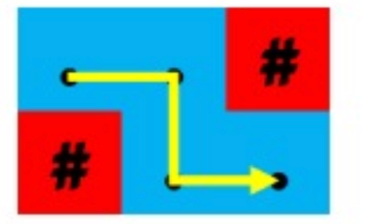

# Warung Nasgor

## Deskripsi
Sayed ingin membeli nasi goreng pada tengah malam. Namun, satu-satunya warung nasi goreng yang masih buka berada di ujung kampung. Denah kampung Sayed dimodelkan dengan sebuah grid yang berukuran $N \times M$. Petak $(x, y)$ adalah petak di baris $x$ dan kolom $y$. Mula-mula Sayed berada di petak $(1,1)$ dan warung nasi goreng berada di petak $(N,M)$. Grid tersebut direpresentasikan dengan matriks $A$ dengan ketentuan sebagai berikut.

- Jika $A_{i,j}=$`.` maka petak $(i,j)$ dapat dilewati.
- Jika $A_{i,j}=$`#` maka petak $(i,j)$ tidak dapat dilewati.
- $A_{1,1}=A_{N,M}=$`.`

Karena khawatir warung akan segera tutup, Sayed hanya akan berjalan ke arah timur ($i+$) atau selatan ($j+$). Dijamin ada jalan ke warung dengan cara tersebut. Karena hari sudah malam, Sayed tidak ingin berbelok arah terlalu banyak. Tentukan banyaknya perubahan arah minimal yang dapat Sayed capai!

## Batasan

- $1 \leq N,M \leq 300$
- $2 \leq N \times M$
- Dijamin bahwa Sayed bisa pergi ke warung hanya dengan bergerak ke arah timur dan selatan.

## Subsoal

1. `(14 poin)` Hanya berisi kasus uji berikut.
    ```
    4 4
    ....
    ..#.
    #..#
    .#..
    ```
2. `(14 poin)` Hanya berisi kasus uji berikut.
    ```
    7 8
    ..#..#..
    #..#..#.
    .#..#..#
    ..#..#..
    #..#..#.
    .#..#..#
    ..#..#..
    ```
3. `(10 poin)` $N=1$
4. `(20 poin)` $N,M \leq 10$
5. `(20 poin)` Terdapat suatu nilai $k$ sehingga $A_{i,j}=$`.` jika dan hanya jika $(i-1) \times K \leq j \leq i \times K $.
6. `(22 poin)` Tidak ada batasan tambahan.

## Masukan
Masukan diberikan dalam format berikut.
```
N M
A(1,1) ... A(1,M)
...
A(N,1) ... A(N,M)
```

## Keluaran
Sebuah beris berisi sebuah bilangan yang menyatakan banyaknya perubahan arah minimal.

## Contoh Masukan
```
2 3
..#
#..
```

## Contoh Keluaran
```
2
```

## Penjelasan Contoh
Berikut adalah ilustrasi satu-satunya jalan yang membutuhkan 2 kali perubahan arah.



<details>
<summary><h2>Proposed Solution</h2></summary>

Kita akan menggunakan pendekatan dengan **Breadth-First Search (BFS)** untu menemukan jumlah perubahan arah minimal.

### Ide Solusi
1. **Definisi Arah**
   - Kita hanya memiliki dua kemungkinan arah: ke **kanan** (timur) dan ke **bawah** (selatan).
2. **Simulasi Jalur**
   - Gunakan BFS untuk menjelajahi grid dari titik awal $(1,1)$ ke titik tujuan $(N,M)$.
   - Setiap kali arah berubah (misalnya dari kanan ke bawah atau sebaliknya), tambahkan 1 ke jumlah perubahan arah.
3. **Perhitungan Minimal**
   - Jaga jumlah perubahan arah minimum saat mencapai tujuan.
4. **Efisiensi**
   - Karena $N,M \leq 300$, solusi BFS dapat diselesaikan dalam waktu $O(N \times M)$.

### Implementasi dalam C++

```cpp
#include <iostream>
#include <vector>
#include <queue>
#include <tuple>
#include <climits>
using namespace std;

// Direction vectors: right (0) and down (1)
const int dx[] = {0, 1};
const int dy[] = {1, 0};

int minimalTurns(int N, int M, vector<string>& grid) {
    vector<vector<vector<int>>> dist(N, vector<vector<int>>(M, vector<int>(2, INT_MAX)));
    queue<tuple<int, int, int>> q; // (x, y, direction)

    // Initialize BFS
    dist[0][0][0] = 0;
    dist[0][0][1] = 0;
    q.push({0, 0, 0});
    q.push({0, 0, 1});

    while (!q.empty()) {
        auto [x, y, dir] = q.front();
        q.pop();

        for (int nextDir = 0; nextDir < 2; ++nextDir) {
            int nx = x + dx[nextDir];
            int ny = y + dy[nextDir];

            if (nx >= 0 && nx < N && ny >= 0 && ny < M && grid[nx][ny] == '.') {
                int turns = dist[x][y][dir] + (dir != nextDir);

                if (turns < dist[nx][ny][nextDir]) {
                    dist[nx][ny][nextDir] = turns;
                    q.push({nx, ny, nextDir});
                }
            }
        }
    }

    // Return the minimal turns to reach (N-1, M-1)
    return min(dist[N-1][M-1][0], dist[N-1][M-1][1]);
}

int main() {
    int N, M;
    cin >> N >> M;

    vector<string> grid(N);
    for (int i = 0; i < N; ++i) {
        cin >> grid[i];
    }

    cout << minimalTurns(N, M, grid) << endl;

    return 0;
}

```

</details>